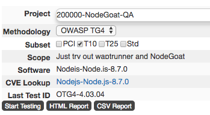
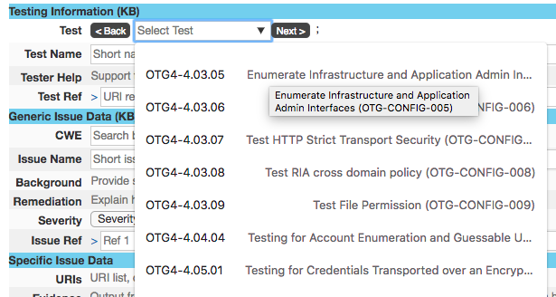
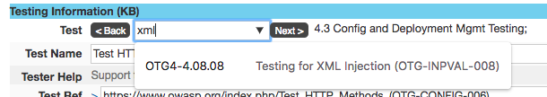
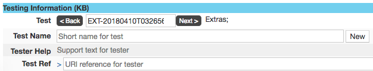
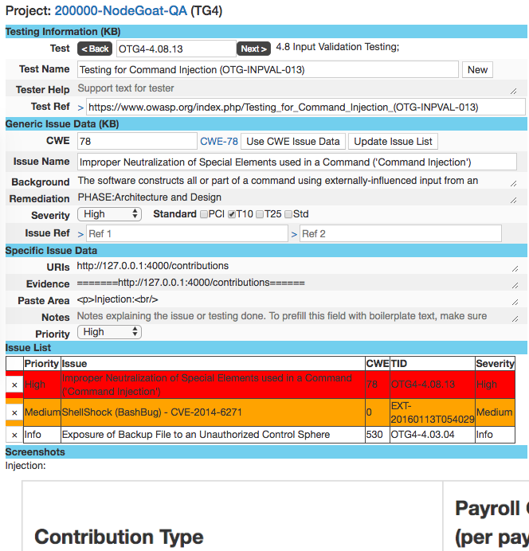
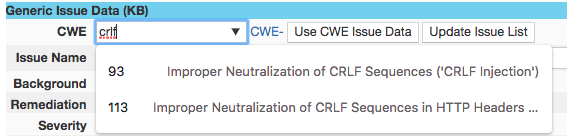
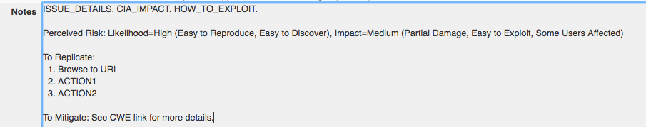
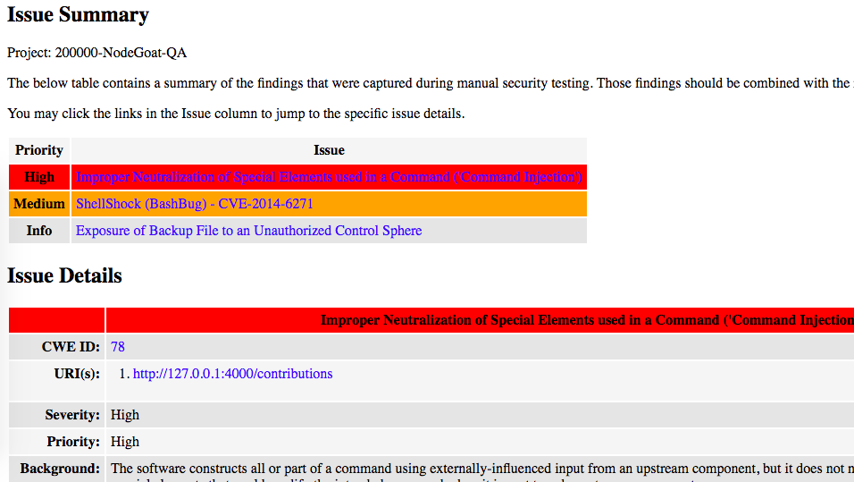
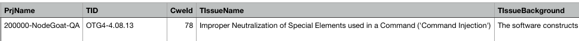
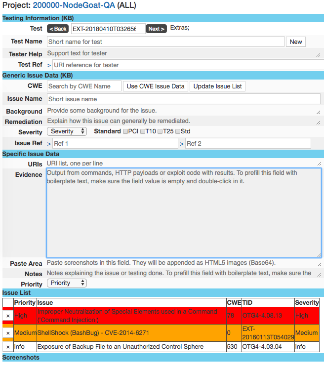

# Web App Pen Test Runner

<!-- TOC -->

- [Web App Pen Test Runner](#web-app-pen-test-runner)
    - [Overview](#overview)
    - [Running this code within Docker](#running-this-code-within-docker)
        - [Get the code](#get-the-code)
        - [Start App and DB servers in separate containers](#start-app-and-db-servers-in-separate-containers)
        - [Browse to the app](#browse-to-the-app)
        - [Stop App and DB containers](#stop-app-and-db-containers)
    - [Basic Idea](#basic-idea)
    - [Design focus](#design-focus)
        - [Phase 1](#phase-1)
        - [Phase 2](#phase-2)
        - [Phase 3](#phase-3)
        - [Phase 4](#phase-4)
        - [Phase 5](#phase-5)
        - [Phase 6](#phase-6)
    - [Additional Criteria](#additional-criteria)
    - [Current Features](#current-features)
    - [IMPORTANT NOTE](#important-note)
    - [Snyk Results](#snyk-results)

<!-- /TOC -->

## Overview

This is a tool that has helped me run through web app pen tests by stepping through various tests and log issues easily without taking too much screen space -- i.e. allowing tiling of the AUT on the left side of the screen (~75% width) and this test runner app on the right (~25% width).

It is built on NodeJS, ExpressJS and PassportJS and it uses a MongoDB to persist the results and to evolve a Security Testing Knowledge Base over time, from our own testing. It can easily run in a lightweight Docker container and it allows for multiple testers to contribute on the same or different projects from the same Node server or the same MongoDB (issues are logged as quickly and atomically as possible). It's not impossible to experience some data update issues while working collaboratively but it is assumed that concurrent testers communicate via Slack/Teams/Skype while dividing and conquering.

## Running this code within Docker

**WARNING**: This won't work until I include a sanitized MongoDB snapshot or an import mechanism. See [Issues](https://github.com/jourzero/waptrun/issues).

### Get the code

```bash
$ git clone git@github.com:jourzero/waptrun.git
$ cd waptrun
```

### Start App and DB servers in separate containers

```bash
# Build and run
$ docker-compose up -d

# Get a shell in each container (App and DB servers)
$ docker exec -it waptr /bin/sh
$ docker exec -it waptrdb /bin/sh
```

### Browse to the app

Browse to http://localhost:5000

### Stop App and DB containers

```bash
$ docker-compose stop
```

## Basic Idea

This project was initiated when I started spending more time doing app security testing. I felt challenged trying to streamline my testing while trying to maximize coverage, trying to avoid missing special stuff and trying to capture useful findings without getting bogged down. In other words, I needed something to help keep my mind free, focused and engaged while not missing the capture of manual findings along the way.

Methodologies are supposed to be good for test streamlining but they are traditionally not that good at reducing the time it takes to test and they prevent us from adjusting our strategy based on signs of weaknesses and choosing the right rabbit hole. However, I have to say that The Bug Hunter Methodology is the closest thing I can think of that can qualify as a nearly-repetitive and methodical hacker approach. But it doesn't help to capture the results and stay focused by completing a testing mandate. The missing link is a targeted tool to avoid losing context while testing by capturing findings easily and iteratively.

## Design focus

The above Basic Idea was a statement of a bug hunter's frustrations that needed to be translated into a Design. Requirements and Design are blurred voluntarily to avoid losing track of _the thing_ to build.

The tool's design approach considered the Web App Pen Testing Workflow and Security Tester User Experience requirements.

### Phase 1

Define the test project scope and perform some high-level footprinting and architectural analysis. Fill the first project level (project page). Help put yourself in a test strategy mode.



### Phase 2

Do your natural app mapping/discovery/inspection by using the app and looking at the traffic in Burp. Use some of the first set of listed tests (from OWASP Testing Guide, Portswigger, Bug Hunter's Methodology) to remind yourself of important stuff to avoid closing down your mind on testing options. Get tactical. Understand the technology and design choices that were made while building the AUT:

.

If browsing for a test is too cumbersome, search for it:

.

If you consider that a test is missing, add it:

.

### Phase 3

Once you have enough payloads, perform some targeted scanning from interesting requests. Save important scanner issues into the tool as Issues (use Burp Clipboarder extension to populate various fields with issue data). These automated test results will help build attack scenarios or think of manual tests to conduct.

.

### Phase 4

Execute some targeted manual tests. Look at the scanner findings, use your judgment from the technology, your gut feel and experience. Capture the interesting findings and dig deeper later. Copy/paste payloads into the Evidence field.

Capture screenshots and paste them into the Paste Area field.


### Phase 5

Look at all accumulated results and try to build a successful attack that'll compromise the system or provide sufficient worry about the security of the system. Capture payloads and screenshots and explain the risk. Search for the closest CWE that provides background for the issue and add our expert opinions.



Add notes by filling the template to explain the issue in details, the risk, the impact, etc.



### Phase 6

Generate a report and review it. Tweak your findings and regenerate the report. Submit your report and call a review meeting after the team has had a chance to review or even comment on the report.

Export to a single-file HTML for easy pasting or attachment into emails or ticketing systems:



Export to CSV to help PMs with remediation tracking:



## Additional Criteria

-   Keep the app's window small and useful. Use field auto-expansion to avoid scrolling and to provide a compact snapshot of results.
-   Avoid too many clicks by keeping all inputs in a single window and use UI automations and artifacts (mouse hovering, links).
-   Separate field for Severity and Priority. The latter is representative of risk and other factors that should adjust how quickly we should implement a fix.
-   Keep history of remediated issues (use Priority = Remediated)

Resulting page with TestKB, Generic Issue Data, Specific Issue Data and Issue List:



## Current Features

-   Multi-project
-   Multi-methodology
-   Test stepping
-   Dynamic Test KB updates
-   Dynamic, color-coded issue list, per project
-   Auto-type test names and CWEs
-   Ability to add new tests based on new CVEs or other
-   CVE search on cvedetails.com
-   Export to CSV and HTML from UI
-   Import Burp issues from my Clipboarder Burp App. To use it:
    -   Download my [Clipboarder extension](https://github.com/jourzero/clipboarder/blob/master/dist/Clipboarder.jar)
    -   Add Clipboarder extension to Burp
    -   Select one issue from Target/Issues
    -   Use context menu "Copy as free text to clipboard"
    -   Paste clipboard content into WAPT Runner's Notes field
    -   Result: Burp issue text will be parsed and UI fields like Issue Name, Evidence, Severity, Priority will be adjusted accordingly.
-   Import screenshots from clipboard and paste them into the Paste Area as HTML5 Base64 images.
    -   Screenshots are shown when viewing an issue from the issue list.
    -   Screenshots are included in reports.
-   User Authentication with Passport, and MongoDB.
-   Serve static content with Express.js
-   App was dockerized.

## IMPORTANT NOTE

-   Without a starting MongoDB dataset, this app is useless for anyone else but me. See [Issues](https://github.com/jourzero/waptrun/issues)


## Snyk Results

[](https://snyk.io/test/github/jourzero/waptrun)
