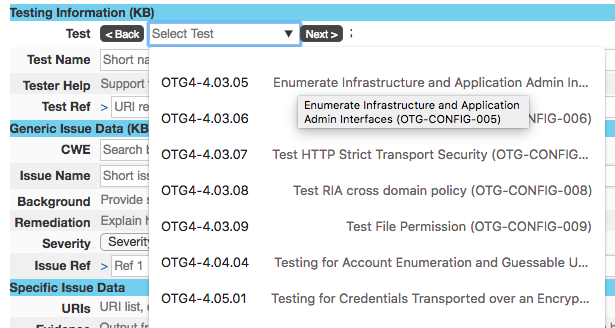
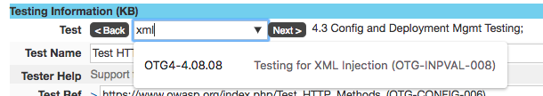
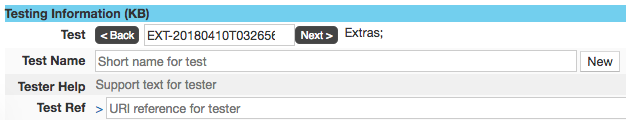
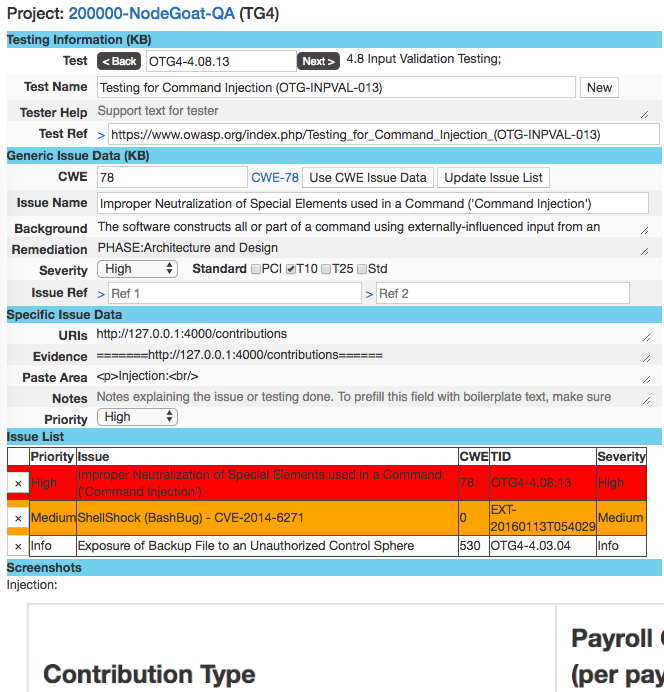
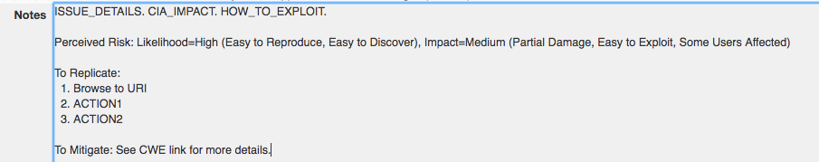
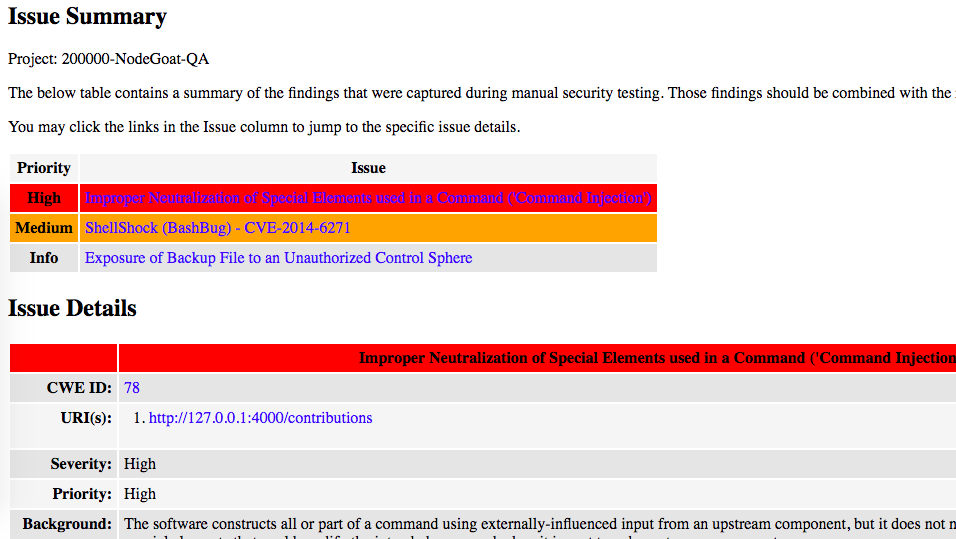

<link rel="stylesheet" href="/dist/bootstrap/css/bootstrap.min.css">

# Web App Pen Test Runner

**Table of Contents**

<!-- TOC -->

-   [Web App Pen Test Runner](#web-app-pen-test-runner)
    -   [Overview](#overview)
        -   [Methodologies Supported](#methodologies-supported)
        -   [Intro](#intro)
        -   [Concept](#concept)
        -   [Design](#design)
    -   [Phased Approach](#phased-approach)
        -   [Scoping](#scoping)
        -   [Mapping](#mapping)
        -   [Vuln Discovery](#vuln-discovery)
            -   [Scanning](#scanning)
            -   [Manual Testing](#manual-testing)
        -   [Exploitation](#exploitation)
        -   [Reporting](#reporting)

<!-- /TOC -->

## Overview

### Methodologies Supported

Refer to [Methodologies](Methodologies.md).

### Intro

This is a tool that has helped me run through app pen tests by stepping through various tests and log issues easily without taking too much screen space -- i.e. allowing tiling of the AUT on the left side of the screen (75% width) and this test runner app on the right (25% width).

It is built on NodeJS, ExpressJS and PassportJS and it uses a MongoDB to persist the results and to evolve a Security Testing Knowledge Base over time, from our own testing. It can easily run in a lightweight Docker container and it allows for multiple testers to contribute on the same or different projects from the same Node server or the same MongoDB (issues are logged as quickly and atomically as possible). It's not impossible to experience some data update issues while working collaboratively but it is assumed that concurrent testers communicate via Slack/Teams/Skype while dividing and conquering.

### Concept

This project was initiated when I started spending more time doing app security testing. I felt challenged trying to streamline my testing while trying to maximize coverage, trying to avoid missing special stuff and trying to capture useful findings without getting bogged down. In other words, I needed something to help keep my mind free, focused and engaged while not missing the capture of manual findings along the way.

[Methodologies](Methodologies.md) are supposed to be good for test streamlining but they are traditionally not that good at reducing the time it takes to test and they prevent us from adjusting our strategy based on signs of weaknesses and choosing the right rabbit hole. However, I have to say that The Bug Hunter Methodology is the closest thing I can think of that can qualify as a nearly-repetitive and methodical hacker approach. But it doesn't help to capture the results and stay focused by completing a testing mandate. The missing link is a targeted tool to avoid losing context while testing by capturing findings easily and iteratively.

### Design

The above Basic Idea was a statement of a pentester's frustrations that needed to be translated into a Design. Requirements and Design are blurred voluntarily to avoid losing track of _the thing_ to build. The problem I wanted to solve with this app is to streamline my work by following a methodology while preserving some agility during testing (jumping between phases).

The tool's design approach considered the Web App Pen Testing Workflow and Security Tester User Experience requirements.

## Phased Approach

### Scoping

Define the test project scope and perform some high-level footprinting and architectural analysis. Fill the first project level (project page). Help put yourself in a test strategy mode.

### Mapping

Do your natural app mapping/discovery/inspection by using the app and looking at the traffic in Burp. Use some of the first set of listed tests from [supported methodologies](Methodologies.md) to remind yourself of important stuff to avoid closing down your mind on testing options. Get tactical. Understand the technology and design choices that were made while building the AUT:

.

If browsing for a test is too cumbersome, search for it:

.

If you consider that a test is missing, add it:

.

### Vuln Discovery

#### Scanning

Once you have enough payloads, perform some targeted scanning from interesting requests. Save important scanner issues into the tool as Issues. Use [Burp Clipboarder extension](https://github.com/jourzero/clipboarder) to populate various fields with issue data. These automated test results will help build attack scenarios or think of manual tests to conduct.

.

#### Manual Testing

Execute some targeted manual tests. Look at the scanner findings, use your judgment from the technology, your gut feel and experience. Capture the interesting findings and dig deeper later. Copy/paste payloads into the Evidence field.

Capture screen shots and paste them into the Paste Area field.

### Exploitation

Look at all accumulated results and try to build a successful attack that'll compromise the system or provide sufficient worry about the security of the system. Capture payloads and screen shots and explain the risk. Search for the closest CWE that provides background for the issue and add our expert opinions.

Add notes by filling the template to explain the issue in details, the risk, the impact, etc.

### Reporting

Generate a report and review it. Tweak your findings and regenerate the report. Submit your report and call a review meeting after the team has had a chance to review or even comment on the report.

Export to a single-file HTML for easy pasting or attachment into emails or ticketing systems:

Export to CSV to help PMs with remediation tracking:

