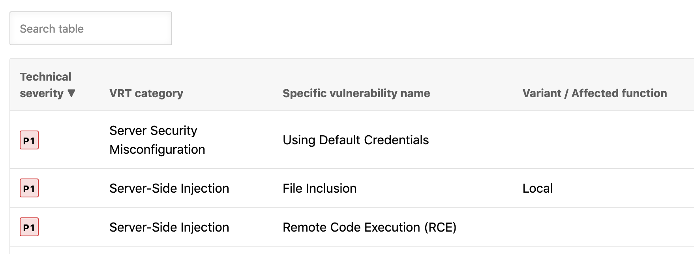
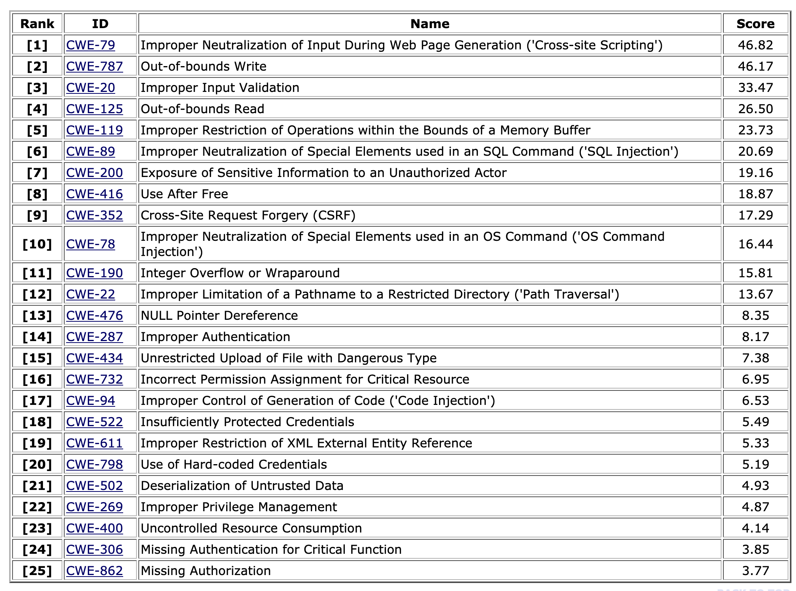
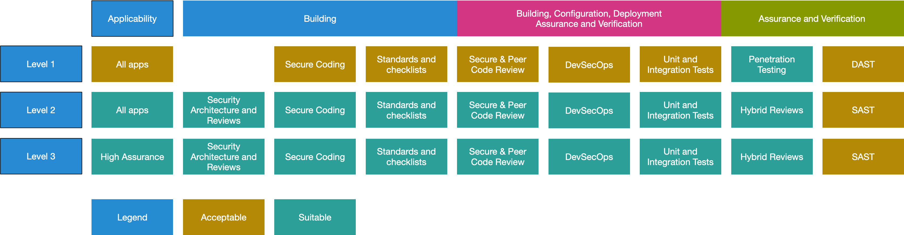
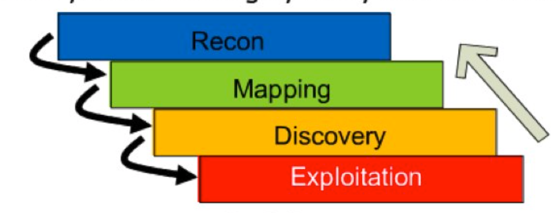
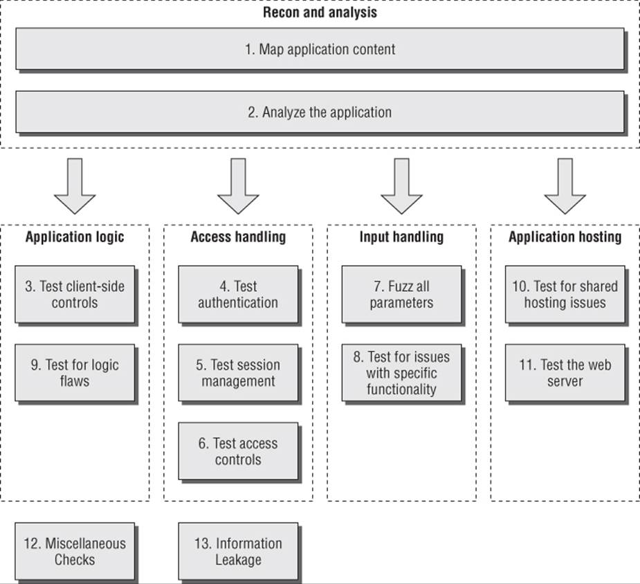

<link rel="stylesheet" href="/dist/bootstrap/css/bootstrap.min.css">
<link rel="stylesheet" href="/stylesheets/documentation.css">

# Methodologies

**Table of Contents**

<!-- TOC -->

-   [Methodologies](#methodologies)
    -   [Supported Methodologies](#supported-methodologies)
        -   [Filters](#filters)
    -   [References](#references)
        -   [API Tests](#api-tests)
        -   [Bugcrowd VRT](#bugcrowd-vrt)
        -   [CWE Top 25](#cwe-top-25)
        -   [Extras](#extras)
        -   [OWASP TG](#owasp-tg)
        -   [OWASP WSTG](#owasp-wstg)
        -   [OWASP ASVS](#owasp-asvs)
        -   [SANS SEC-542](#sans-sec-542)
        -   [SANS SEC-642](#sans-sec-642)
        -   [TBHM](#tbhm)
        -   [WAHH](#wahh)

<!-- /TOC -->

## Supported Methodologies

| Type        | Methodology Name                                        | Version Supported | Summary                                      |
| ----------- | ------------------------------------------------------- | ----------------- | -------------------------------------------- |
| Combination | All Tests                                               |                   | Includes all tests from below methodologies  |
| Combination | API Tests                                               |                   | Includes API tests from below methodologies  |
| Combination | Combo                                                   |                   | Includes combination of below with "(\*)"    |
| Helpers     | [BugCrowd Vulnerability Rating Taxonomy](#bugcrowd-vrt) | v1.3 (2017)       | Not a methodology but a useful ref.          |
| Helpers     | [CWE Top 25](#cwe-top-25)                               | (2020)            | SANS' list of top 25 software bugs (as CWEs) |
| Helpers     | [Extras](#extras) (\*)                                  | (2020)            | Tests we added manually ourselves            |
| OWASP       | [Web App Security Test Guide](#owasp-tg)                | V4.0 (2014)       | Test Guide from OWASP (current release)      |
| OWASP       | [Web Security Testing Guide](#owasp-wstg) (\*)          | V5.0 (2020)       | Test Guide from OWASP (next release)         |
| OWASP       | [ASVS](#owasp-asvs)                                     | v4.0.2 (2020)     | App Security Verification Standard           |
| SANS        | [SEC542](#sans-sec-542)                                 |                   | SANS Web App Pen Testing Methodology         |
| SANS        | [SEC642](#sans-sec-642)                                 |                   | SANS Advanced Web App Pen Testing (add-ons)  |
| De-facto    | [The Bug Hunter Methodology](#tbhm) (\*)                | v1.0 (2015)       | Useful tests for bug hunting                 |
| De-facto    | [Web App Hacking Handbook (WAHH)](#wahh) (\*)           | Vol. 2 (2011)     | Well-respected methodology (de-facto)        |

### Filters

| Key | Purpose                                                           |
| --- | ----------------------------------------------------------------- |
| PCI | Tests that are applicable to help meet PCI-DSS (R6.5/R6.6)        |
| T10 | Tests that apply to the OWASP Top 10 Issues                       |
| T25 | Tests that apply to the SANS/CWE Top 25 dangerous security issues |
| Std | Tests that we want to perform in most of our assessments          |

## References

### API Tests

Our combined list of API tests from various sources. We use a complex database query to build this list.

### Bugcrowd VRT

The [Bugcrowd’s Vulnerability Rating Taxonomy](https://bugcrowd.com/vulnerability-rating-taxonomy) is a resource outlining Bugcrowd’s baseline priority rating, including certain edge cases, for common vulnerabilities.

### CWE Top 25

The 2020 Common Weakness Enumeration (CWE™) [Top 25 Most Dangerous Software Weaknesses](https://cwe.mitre.org/top25/archive/2020/2020_cwe_top25.html) (CWE Top 25) is a demonstrative list of the most common and impactful issues experienced over the previous two calendar years. These weaknesses are dangerous because they are often easy to find, exploit, and can allow adversaries to completely take over a system, steal data, or prevent an application from working. The CWE Top 25 is a valuable community resource that can help developers, testers, and users — as well as project managers, security researchers, and educators — provide insight into the most severe and current security weaknesses.

### Extras

The [Extras](https://github.com/jourzero/waptrun/blob/master/dbinit/testkb-extras.csv) include tests that we felt were missing from common methodologies and that we decided to add manually in the Testing screen.

### OWASP TG

Refer to [OWASP Web App Testing Guide](https://owasp.org/www-project-web-security-testing-guide/assets/archive/OWASP_Testing_Guide_v4.pdf) (v4).

### OWASP WSTG

Refer to the current [Web Security Test Guide](https://github.com/OWASP/wstg) (v5).

### OWASP ASVS

Refer to [OWASP ASVS v4.0.2](https://github.com/OWASP/ASVS/tree/v4.0.2/4.0/en).

### SANS SEC-542

Refer to the SANS [SEC-542 Syllabus](https://www.sans.org/cyber-security-courses/web-app-penetration-testing-ethical-hacking/).

### SANS SEC-642

Refer to the SANS [SEC-642 Syllabus](https://www.sans.org/cyber-security-courses/advanced-web-app-penetration-testing-ethical-hacking/).

### TBHM

Refer to the [Bug Hunter's Methodology](https://github.com/jhaddix/tbhm#the-bug-hunters-methodology-tbhm) (TBHM).

### WAHH

Refer to the [Web Application Hacker's Handbook](https://portswigger.net/web-security/web-application-hackers-handbook). There's also the related [Burp Documentation](https://portswigger.net/burp/documentation/contents) that provides additional substance and [workflow](https://portswigger.net/burp/documentation/desktop/penetration-testing#testing-workflow) details.

