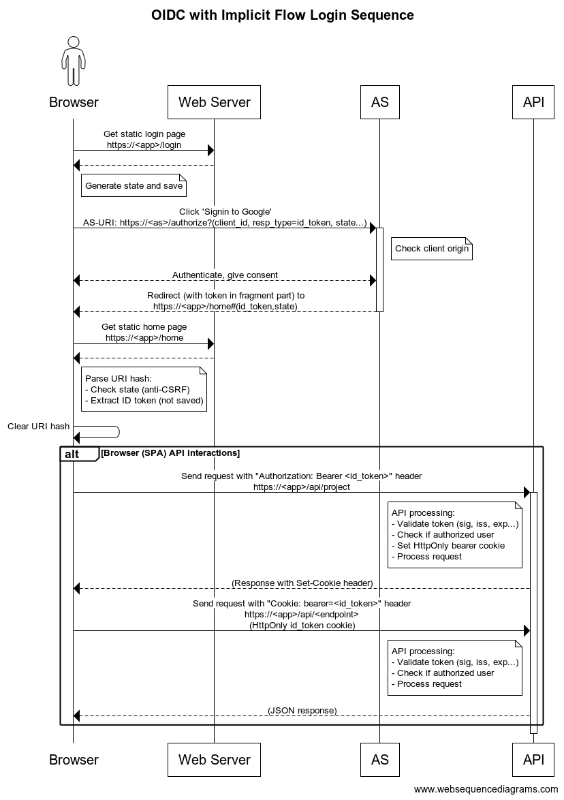

# OAuth/OIDC Threat Assessment

## Purpose

Evaluate threats to our Authentication/Authorization model that's based on Google's OAuth2 Implicit Flow with OpenID Connect, leveraging documented OAuth/OIDC security considerations.

We use a checklist approach to ensure we have reviewed most documented security considerations and that we have an acceptable implementation, given acceptable risk, time and resources.

## Checklist Legend

-   [x] Security issue has been addressed
-   [ ] Security issue remains to be reviewed or addressed
-   [ ] (N/A) Security issue will not be addressed due it's non-applicability or its perceived low risk
-   [ ] (TODO) Countermeasure to be implemented

## Table of Content

<!-- TOC -->

-   [OAuth/OIDC Threat Assessment](#oauthoidc-threat-assessment)
    -   [Purpose](#purpose)
    -   [Checklist Legend](#checklist-legend)
    -   [Table of Content](#table-of-content)
    -   [Sequence Diagram](#sequence-diagram)
    -   [Threat Model](#threat-model)
        -   [OAuth 2.0 Threat Model (rfc6819)](#oauth-20-threat-model-rfc6819)
            -   [4.4.2 Implicit Grant](#442-implicit-grant)
            -   [4.4.2.1. Threat: Access Token Leak in Transport/Endpoints](#4421-threat-access-token-leak-in-transportendpoints)
            -   [4.4.2.2. Threat: Access Token Leak in Browser History](#4422-threat-access-token-leak-in-browser-history)
            -   [4.4.2.3. Threat: Malicious Client Obtains Authorization](#4423-threat-malicious-client-obtains-authorization)
            -   [4.4.2.4. Threat: Manipulation of Scripts (JS from web server)](#4424-threat-manipulation-of-scripts-js-from-web-server)
            -   [4.4.2.5. Threat: CSRF Attack against redirect-uri](#4425-threat-csrf-attack-against-redirect-uri)
            -   [4.4.2.6. Threat: Token Substitution (OAuth Login)](#4426-threat-token-substitution-oauth-login)
        -   [Security Considerations from OpenID Connect Core 1.0](#security-considerations-from-openid-connect-core-10)
            -   [16.1. Request Disclosure](#161-request-disclosure)
            -   [16.2. Server Masquerading](#162-server-masquerading)
            -   [16.3. Token Manufacture/Modification](#163-token-manufacturemodification)
            -   [16.4. Access Token Disclosure](#164-access-token-disclosure)
            -   [16.5. Server Response Disclosure](#165-server-response-disclosure)
            -   [16.6. Server Response Repudiation](#166-server-response-repudiation)
            -   [16.7. Request Repudiation](#167-request-repudiation)
            -   [16.8. Access Token Redirect](#168-access-token-redirect)
            -   [16.9. Token Reuse](#169-token-reuse)
            -   [16.10. Eavesdropping or Leaking Authorization Codes (Secondary Authenticator Capture)](#1610-eavesdropping-or-leaking-authorization-codes-secondary-authenticator-capture)
            -   [16.11. Token Substitution](#1611-token-substitution)
            -   [16.12. Timing Attack](#1612-timing-attack)
            -   [16.13. Other Crypto Related Attacks](#1613-other-crypto-related-attacks)
            -   [16.14. Signing and Encryption Order](#1614-signing-and-encryption-order)
            -   [16.15. Issuer Identifier](#1615-issuer-identifier)
            -   [16.16. Implicit Flow Threats](#1616-implicit-flow-threats)
            -   [16.17. TLS Requirements](#1617-tls-requirements)
            -   [16.18. Lifetimes of Access Tokens and Refresh Tokens](#1618-lifetimes-of-access-tokens-and-refresh-tokens)
            -   [16.19. Symmetric Key Entropy](#1619-symmetric-key-entropy)
            -   [16.20. Need for Signed Requests](#1620-need-for-signed-requests)
            -   [16.21. Need for Encrypted Requests](#1621-need-for-encrypted-requests)
    -   [TODO](#todo)
    -   [Appendix](#appendix)
        -   [Google OAuth2 Config](#google-oauth2-config)

<!-- /TOC -->

## Sequence Diagram



## Threat Model

### OAuth 2.0 Threat Model (rfc6819)

Ref.: [RFC6819 - Section 4.4.2: Implicit Grant Threat Model](https://datatracker.ietf.org/doc/html/rfc6819#section-4.4.2)

#### 4.4.2 Implicit Grant

> In the implicit grant type flow, the access token is directly returned to the client as a fragment part of the redirect URI. It is
> assumed that the token is not sent to the redirect URI target, as HTTP user agents do not send the fragment part of URIs to HTTP
> servers. Thus, an attacker cannot eavesdrop the access token on this communication path, and the token cannot leak through HTTP referrer
> headers.

-   [x] Google sends the token in the fragment part

#### 4.4.2.1. Threat: Access Token Leak in Transport/Endpoints

> This token might be eavesdropped by an attacker. The token is sent from the server to the client via a URI fragment of the redirect URI.
> If the communication is not secured or the endpoint is not secured, the token could be leaked by parsing the returned URI.
> Impact: The attacker would be able to assume the same rights granted by the token.

-   [x] The authorization server should ensure confidentiality (e.g., using TLS) of the response from the authorization server to the
        client (see Section 5.1.1) - Using TLS

#### 4.4.2.2. Threat: Access Token Leak in Browser History

> An attacker could obtain the token from the browser's history.

-   [x] Short expiry time for tokens - Google uses 1 hour which is OK for this app: exp - iat = 3600. We also overwrite the history via JS using
        [replaceState](https://developer.mozilla.org/en-US/docs/Web/API/History/replaceState) to remove traces of the token in hashed links.

-   [x] Reduced scope of the token to reduce the impact of an attack (openid email) - returned data:
        `{"iss":"accounts.google.com","azp":"<SAME_AS_AUD>","aud":"<GOOGLE_OAUTH_CLIENT_ID>","sub":"<SUBSCRIBER_ID>", "email":"<USER_EMAIL_ADDRESS>","email_verified":true,"iat":1642532533,"exp":1642536133,"jti":"<TOKEN_ID>"}`

-   [x] Make responses non-cacheable (Google does that).

#### 4.4.2.3. Threat: Malicious Client Obtains Authorization

> A malicious client could attempt to obtain a token by fraud. The same countermeasures as for Section 4.4.1.4 are applicable (see below
> countermeasures from 4.4.1.4), except client authentication.

-   [ ] (N/A) Authorization server should authenticate the client, if possible. Authentication takes place after end user has authorized access.

-   [x] The authorization server should validate the client's redirect URI against the pre-registered redirect URI, if one exists (see
        Section 5.2.3.5). Note: An invalid redirect URI indicates an invalid client, whereas a valid redirect URI does not necessarily
        indicate a valid client...

-   [x] After authenticating the end user, the authorization server should ask him/her for consent. In this context, the authorization
        server should explain to the end user the purpose, scope, and duration of the authorization the client asked for. Moreover, the
        authorization server should show the user any identity information it has for that client. It is up to the user to validate the
        binding of this data to the particular application (e.g., Name) and to approve the authorization request (see Section 5.2.4.3).

-   [x] The authorization server should not perform automatic re-authorizations for clients it is unable to reliably
        authenticate or validate (see Section 5.2.4.1).

-   [ ] (N/A) If the authorization server automatically authenticates the end user, it may nevertheless require some user input in order to
        prevent screen scraping. Examples are CAPTCHAs (Completely Automated Public Turing tests to tell Computers and Humans Apart)
        or other multi-factor authentication techniques such as random questions, token code generators, etc.

-   [ ] (N/A) The authorization server may also limit the scope of tokens it issues to clients it cannot reliably authenticate (see Section 5.1.5.1).

#### 4.4.2.4. Threat: Manipulation of Scripts (JS from web server)

> A hostile party could act as the client web server and replace or modify the actual implementation of the client (script). This could be achieved using
> DNS or ARP spoofing. This applies to clients implemented within the web browser in a scripting language. Impact: The attacker could obtain user credential
> information and assume the full identity of the user.

-   [ ] (N/A) The authorization server should authenticate the server from which scripts are obtained (see Section 5.1.2).

-   [x] The client should ensure that scripts obtained have not been altered in transport (see Section 5.1.1).

-   [ ] (N/A) Introduce one-time, per-use secrets (e.g., "client_secret") values that can only be used by scripts in a small time window once
        loaded from a server. The intention would be to reduce the effectiveness of copying client-side scripts for re-use in an
        attacker's modified code.

#### 4.4.2.5. Threat: CSRF Attack against redirect-uri

-   [x] The "state" parameter should be used to link the authorization request with the redirect URI used to deliver the access token.
        This will ensure that the client is not tricked into completing any redirect callback unless it is linked to an authorization
        request initiated by the client. The "state" parameter should not be guessable, and the client should be capable of keeping the
        "state" parameter secret.

-   [x] Client developers and end users can be educated to not follow untrusted URLs.

#### 4.4.2.6. Threat: Token Substitution (OAuth Login)

-   [x] Clients should use an appropriate protocol, such as OpenID or SAML to implement user login. Both support audience restrictions on clients.
        i.e. Make sure that the audience is properly restricted (check client ID).

### Security Considerations from OpenID Connect Core 1.0

Ref.: https://openid.net/specs/openid-connect-core-1_0.html#Security

#### 16.1. Request Disclosure

-   [ ] Content of the request is an encrypted JWT with the appropriate key and cipher. This protects even against a compromised User Agent in the case of indirect request.
    > Not implemented. However, as shown in the DFD, we don't store the JWT in memory and we use an http-only/secure session cookie which should help avoid most leakage scenarios, even in
    > compromised user agents (except maybe for a malicious browser extension?).

#### 16.2. Server Masquerading

-   [x] Authenticate the Server through either the use of Signed or Encrypted JWTs with an appropriate key and cipher.

#### 16.3. Token Manufacture/Modification

-   [x] Token digitally signed by the OP. The Relying Party SHOULD validate the digital signature to verify that it was issued by a legitimate OP.
-   [x] Token sent over a protected channel such as TLS.

#### 16.4. Access Token Disclosure

-   [x] Access Tokens represent an End-User's authorization and MUST NOT be exposed to unauthorized parties.

#### 16.5. Server Response Disclosure

-   [ ] (N/A) Using the code Response Type. The response is sent over a TLS protected channel, where the Client is authenticated by the client_id and client_secret.
-   [ ] (N/A) For other Response Types, the signed response can be encrypted with the Client's public key or a shared secret as an encrypted JWT with an appropriate key and cipher.

#### 16.6. Server Response Repudiation

-   [x] The response MAY be digitally signed by the Server using a key that supports non-repudiation.
-   [x] The Client SHOULD validate the digital signature to verify that it was issued by a legitimate Server and its integrity is intact.

#### 16.7. Request Repudiation

-   [ ] The Server MAY require that the request be digitally signed by the Client using a key that supports non-repudiation.
-   [ ] The Server SHOULD validate the digital signature to verify that it was issued by a legitimate Client and the integrity is intact.

#### 16.8. Access Token Redirect

An Attacker uses the Access Token generated for one resource to obtain access to a second resource.

-   [ ] To mitigate this threat, the Access Token SHOULD be audience and scope restricted. One way of implementing it is to include the identifier of the resource for whom
        it was generated as audience. The resource verifies that incoming tokens include its identifier as the audience of the token.

#### 16.9. Token Reuse

-   [ ]

#### 16.10. Eavesdropping or Leaking Authorization Codes (Secondary Authenticator Capture)

-   [ ]

#### 16.11. Token Substitution

-   [ ]

#### 16.12. Timing Attack

-   [ ]

#### 16.13. Other Crypto Related Attacks

-   [ ]

#### 16.14. Signing and Encryption Order

-   [ ]

#### 16.15. Issuer Identifier

-   [ ]

#### 16.16. Implicit Flow Threats

-   [ ]

#### 16.17. TLS Requirements

-   [ ]

#### 16.18. Lifetimes of Access Tokens and Refresh Tokens

-   [ ]

#### 16.19. Symmetric Key Entropy

-   [ ]

#### 16.20. Need for Signed Requests

-   [ ]

#### 16.21. Need for Encrypted Requests

-   [ ]

## TODO

-   Check concerns/attacks/threats in:
    -   RFC6749 section 10
    -   RFC8252 section 8
    -   RFC6819
    -   OAuth 2.0 Security Best Current Practice draft-ietf-oauth-security-topics[-14]
-   Get around issue with stolen API keys with OAuth1 (Twitter app impersonation) -- see https://developer.okta.com/blog/2019/01/22/oauth-api-keys-arent-safe-in-mobile-apps
-   Use PKCE RFC7636 (for apps that can't use a secret), see AppAuth.io code for iOS/Android/JS
-   JWT validation allowing "none" or a symmetric algorithm (like "HS256"). An attacker could inject a tampered token if asymmetric isn't used. With symmetric algo, the attacker would use the public key to sign the token.

## Appendix

### Google OAuth2 Config

Snapshot from https://www.googleapis.com/oauth2/v3/certs:

```json
{
    "keys": [
        {
            "use": "sig",
            "e": "AQAB",
            "kid": "33ff5af12d7666c58f9956e65e46c9c02ef8e742",
            "n": "tQSZmOenF0ffW7BrOzL8u4r5XH0xsI3QpFYvVSCFWrBiPWDPVjfssA6uoGI6sn3aw810Er6Atv2BjeUvrFeMLkFwuRRFyE95aCSx0s-hDNtXsIOvX7LcJgQn3F3gVUPUvQDfL40DnMq0CWWpNCxNggBdok4emegiQO-C4J7aKy_ACcznsmMVtABvJDM_KpayIfWQfujsfQ8x0pggoxfPIopZLzZaMq8teEYcpVzbNvMyMopNMNPvnKMe56O_Clf_3HQBQtovHYCOK33mJmx4u1aijRMIfgoJYdVA26raLYx5_gNu_De9VWyrvknNwCSYtS0t7xIqzH2oiKtGiM9nJw",
            "alg": "RS256",
            "kty": "RSA"
        },
        {
            "n": "wsM16HUl8VtOHqW-QT_k4fe67AsHPZfB05aUSIiSdPOBONDrAq7ylsVOzKRVOuCVwwmLTDL3k6fBFRYDMmhmo28AKkD6AtDA9qqkuXAovA0TFeeQ_WDHlpstE-ZgTPyykIyoG0lIMtdaZ7wKAoNv75QhtI_PAjtmJ4lCa_xx258rxr1-E8ZvUlT2I5gh_vLqYpsRuWX6uZ5Dl5SILPJuwBdfD-PIvgBGEDHT2ZpKR_IoxLNZDR7WtR6xCTiqrPj0SbMOOpyN7G28jH_jJfdw-9CD5AbWN7BlDmJU-oKcgUTee9lZLuYIPy1J7LtAac4MnGMGbupmPOQ1jzAaMpStrw",
            "alg": "RS256",
            "kid": "ca00620c5aa7be8cd03a6f3c68406e45e93b3cab",
            "kty": "RSA",
            "use": "sig",
            "e": "AQAB"
        }
    ]
}
```

Snapshot from https://accounts.google.com/.well-known/openid-configuration:

```json
{
    "issuer": "https://accounts.google.com",
    "authorization_endpoint": "https://accounts.google.com/o/oauth2/v2/auth",
    "device_authorization_endpoint": "https://oauth2.googleapis.com/device/code",
    "token_endpoint": "https://oauth2.googleapis.com/token",
    "userinfo_endpoint": "https://openidconnect.googleapis.com/v1/userinfo",
    "revocation_endpoint": "https://oauth2.googleapis.com/revoke",
    "jwks_uri": "https://www.googleapis.com/oauth2/v3/certs",
    "response_types_supported": ["code", "token", "id_token", "code token", "code id_token", "token id_token", "code token id_token", "none"],
    "subject_types_supported": ["public"],
    "id_token_signing_alg_values_supported": ["RS256"],
    "scopes_supported": ["openid", "email", "profile"],
    "token_endpoint_auth_methods_supported": ["client_secret_post", "client_secret_basic"],
    "claims_supported": ["aud", "email", "email_verified", "exp", "family_name", "given_name", "iat", "iss", "locale", "name", "picture", "sub"],
    "code_challenge_methods_supported": ["plain", "S256"],
    "grant_types_supported": ["authorization_code", "refresh_token", "urn:ietf:params:oauth:grant-type:device_code", "urn:ietf:params:oauth:grant-type:jwt-bearer"]
}
```
